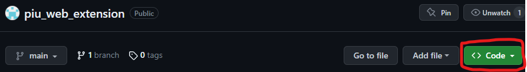
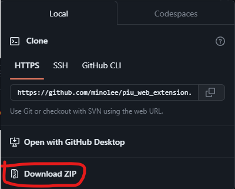
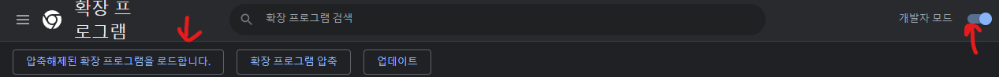
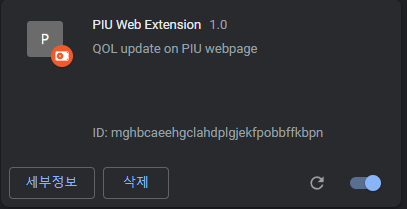
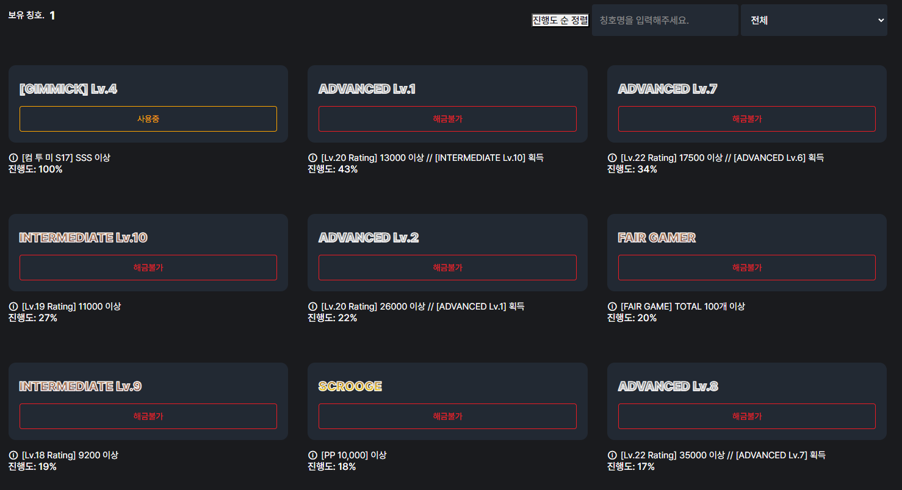

# 펌프 잇 업 웹 확장

## 설치 방법

### Chrome web store를 이용한 설치

[Chrome web store 링크](https://chrome.google.com/webstore/detail/piu-web-extension/pnpgbojaphkeopandieippjlmeaakkke/related)에서 `Chrome에 추가` 버튼을 클릭하면 됩니다.

### 수동 설치

* 파일 다운로드
    * 
    * `Code` 버튼을 클릭합니다

    * 
    * `Download ZIP` 버튼을 클릭해 다운로드 받은 뒤, 압축을 해제해 둡니다. **반드시 새로운 폴더에 압축을 해제해 주세요.**

* 크롬에 확장 추가
    * `chrome://extensions` 또는 크롬 브라우저 주소창 옆의 퍼즐 모양 아이콘을 누른 뒤 `확장 프로그램 관리` 를 클릭합니다.
    
    * 
    * 해당 페이지의 우측 상단에서 `개발자 모드` 를 활성화합니다.

    * 새로 생긴 메뉴 중 `압축해제된 확장 프로그램을 로드합니다.` 를 클릭 후, 압축해제한 폴더를 선택합니다.

    * 
    * 위와 같이 PIU Web Extension이 추가되면 추가된 것입니다.

    * 펌프 잇 업 페이지 로그인 후, 칭호 페이지로 가시면 일정 시간 로딩 후 진행도 및 정렬 버튼이 등장합니다.

## 기능

동작 예시

* 현재 칭호 진행도 표시
    * 일부 칭호는 반영되지 않습니다.
    
* 현재 칭호 진행도 순 정렬 기능

 반영되지 않는 칭호 목록 

* LOVERS
* CO-OP Lv x / ADVANCED / EXPERT / MASTER
* XXX Follower / A huge fan of XXX
    * 채보별 제작자 목록을 제공해 주실 수 있으신 분은 연락해주시면 감사하겠습니다.

## 버그제보
[lmh30002@gmail.com](mailto:lmh30002@gmail.com)으로 스크린샷을 보내 주세요

